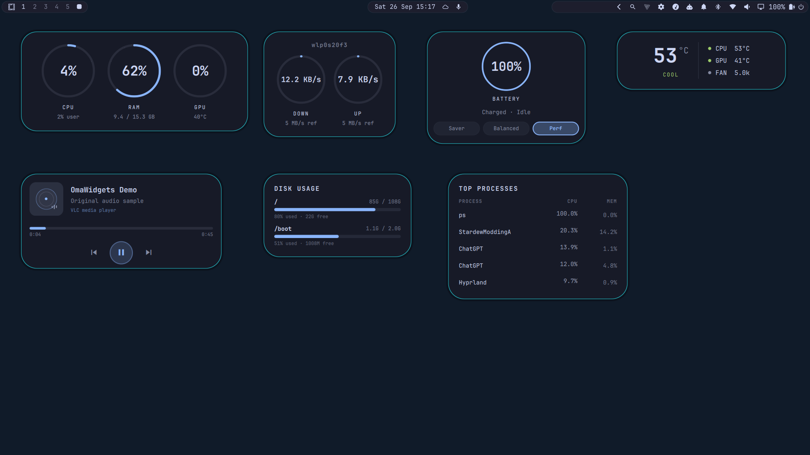
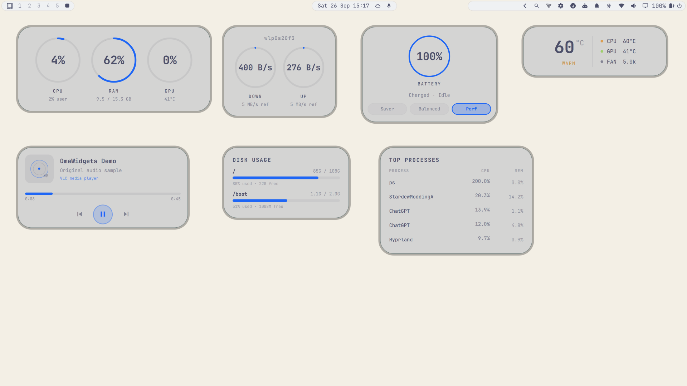
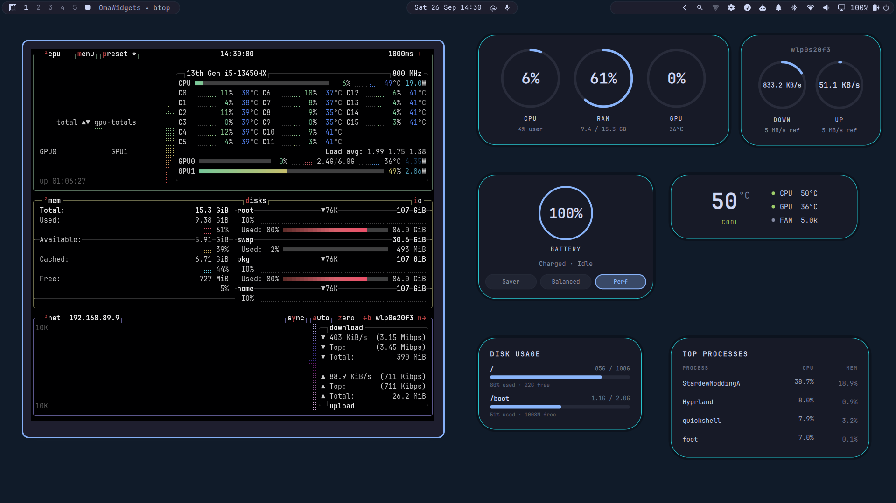

# OmaGlimpse

OmaGlimpse is a set of floating desktop cards for [Omarchy](https://omarchy.org). It puts system activity, battery status, media playback, and other live readings on the desktop, with colors that follow your Omarchy theme. Its Omarchy plugin manifest ID is `io.github.tammyx44.omaglimpse`.



*All seven cards on one desktop in Omarchy's Catppuccin theme. The media card is playing an original demo audio sample.*



*The same seven-card layout in a light Omarchy theme.*

## What it includes

- **System Monitor:** CPU and memory gauges, plus GPU usage when a supported data source is available.
- **Battery & Power:** charge and battery energy flow when UPower reports them; power profile controls when supported by the system.
- **Media Player:** track details and playback controls for an available MPRIS player.
- **Top Processes:** processes ranked by CPU or memory use.
- **Network Speed:** live download and upload rates for an automatically detected or selected interface.
- **Disk Usage:** usage of mounted filesystems.
- **Temperature:** available CPU and GPU sensor readings, with Celsius or Fahrenheit display.

The first four cards are enabled by default. Enable Network Speed, Disk Usage, and Temperature in settings when you want them. Cards support theme-following or custom colors, individual sizing and positioning, layout presets, and optional per-card click-through. The overlay blurs the desktop behind the cards when blur is enabled.



*OmaGlimpse and btop side by side for a visual comparison; the image is not a performance benchmark.*

[Watch the OmaGlimpse demo](assets/omaglimpse-promo.mp4)

## Repository layout

| Path | Purpose |
| --- | --- |
| `manifest.json`, `Widgets.qml` | Declare the Omarchy plugin and coordinate the desktop overlay, card layout, settings, and IPC. |
| `*Widget.qml`, `SystemMonitor.qml`, `Temperature.qml`, `TopProcesses.qml`, `NetworkSpeed.qml`, `DiskUsage.qml` | Render the seven live cards and read their data sources. |
| `SettingsPanel.qml`, `WidgetDropdown.qml`, `WidgetContextMenu.qml`, `SettingsButton.qml` | Provide the settings panel, per-card controls, context menu, and bar button. |
| `WidgetConfig.js`, `WidgetModel.js`, `WidgetTheme.js`, `CircularGauge.qml`, `CompactToggle.qml` | Validate preferences, parse readings, follow theme colors, and share UI controls. |
| `ArtworkPlaceholder.qml`, `fetch_album_art.py` | Draw a theme-matched media placeholder and safely fetch bounded remote cover images. |
| `tests/`, `.github/workflows/` | Check widget behavior and manifest validity locally and in CI. |
| `assets/`, `preview.png` | Hold the approved screenshots, demo video, and marketplace preview. |

## Requirements

- Omarchy with the Quickshell-based `omarchy-shell` and its plugin commands.
- Standard Linux `/proc` and `/sys` interfaces and system utilities (`ps`, `df`, and a POSIX shell) for system, process, disk, network, and sensor readings.
- Optional: UPower for battery status and energy flow; an MPRIS-capable player for media controls; `nvidia-smi` or `rocm-smi` for supported GPU readings. Some GPU and temperature readings can also come from readable `/sys` interfaces.
- Optional: Python 3 and curl 8.4+ for size- and time-limited HTTPS album-cover downloads. Local covers and the theme-matched fallback work without them.
- Optional: `powerprofilesctl` and a supported power-profile driver for profile detection and switching. The profile buttons call Omarchy's `omarchy-powerprofiles-set` command, which also remembers the selection in the user's Omarchy state directory.

Unavailable hardware readings are hidden or shown as unavailable. The plugin does not install extra packages or request elevated privileges.

## Install

```bash
omarchy plugin add https://github.com/TammyX44/OmaGlimpse.git --enable
```

If you installed an earlier development build, remove or disable it before adding this release to avoid duplicate cards. Your saved widget settings remain in a separate JSON file.

The plugin adds a settings button to the Omarchy bar (right section by default).

## Uninstall

Run `omarchy plugin remove` and select the OmaGlimpse installation from the list. Omarchy disables and removes the installed plugin folder. Your separate `~/.config/omarchy/tammy-widgets.json` preferences remain untouched; delete that file manually only if you no longer want them.

## Configure

Click the bar settings button or right-click a card and choose **Open full settings**. Use the panel to enable cards, adjust appearance and card sizes, choose a layout preset, and enter edit mode to drag cards. Card settings include position, opacity, and update interval where applicable. Battery and media readings update through UPower and MPRIS rather than a configurable polling interval.

Settings are saved to `~/.config/omarchy/tammy-widgets.json`. This established filename is retained for compatibility with existing OmaWidgets installations, so existing preferences continue to work after upgrading to OmaGlimpse. You can also edit that JSON file directly; the plugin reloads it when it changes. The file is created when settings are first saved. If the file contains invalid JSON, correct it or use the settings panel's reset control.

The media card reserves its playback height while idle, so starting a player or receiving a track duration does not expand it over neighboring cards. If an older saved layout already overlaps, reposition the affected cards or apply a layout preset once.

Installing the plugin does not overwrite existing preferences. Changes made in the settings panel save to the plugin's own JSON file, and resetting to defaults requires confirmation.

## License

MIT. See [LICENSE](LICENSE).
